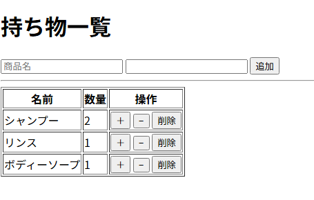

# Store Item Management App

## 📌 概要

Spring Boot を用いて作成した、**シンプルな在庫（アイテム）管理アプリ**です。

* アイテム一覧表示
* アイテム追加（HTMLフォームから POST）
* 数量の増減（+ / − ボタン）
* アイテム削除（確認ダイアログ付き）

バックエンド開発における **MVC構成・CRUD処理・画面連携** の理解を目的として作成しました。

---
## 🖥 アプリ画面

### 一覧画面



* 登録済みアイテムを一覧表示
* 数量の増減が可能（0 の場合は − ボタン無効）
* 削除時は確認ダイアログを表示

---
## 🛠 使用技術

| 分類         | 技術           |
| ---------- | ------------ |
| 言語         | Java         |
| フレームワーク    | Spring Boot  |
| ビルドツール     | Gradle       |
| テンプレートエンジン | Thymeleaf    |
| IDE        | Eclipse（STS） |
| バージョン管理    | Git / GitHub |

---

## 📂 ディレクトリ構成

```
strore
 ├─ controller
 │   ├─ ItemController.java        // REST API 用
 │   └─ ItemViewController.java    // 画面表示用
 ├─ service
 │   └─ ItemService.java            // 業務ロジック
 ├─ repository
 │   └─ ItemRepository.java         // データ管理（Map使用）
 ├─ entity
 │   └─ Item.java                   // エンティティ
 ├─ dto
 │   ├─ ItemRequest.java
 │   └─ UpdateQuantityRequest.java
 └─ resources
     └─ templates
         └─ items.html               // 画面（Thymeleaf）
```

---

## 🧱 設計の考え方（重要）

### MVC アーキテクチャ

| 層          | 役割                |
| ---------- | ----------------- |
| Controller | リクエスト受付・レスポンス制御   |
| Service    | 業務ロジックを担当         |
| Repository | データ管理（今回はDB未使用）   |
| View       | Thymeleaf による画面表示 |

画面用 Controller と API 用 Controller を分離し、
**責務が混ざらない構成**を意識しています。

---

## 💾 データ管理について

本アプリでは **DBを使用せず、Map を用いた簡易リポジトリ**でデータ管理を行っています。

```java
private final Map<Long, Item> store = new HashMap<>();
```

* 学習目的のため、永続化は行っていません
* 将来的に RDB（PostgreSQL 等）へ置き換え可能な構成です

---

## 🖥 画面仕様

### 一覧画面（/items/view）

* 登録済みアイテムの一覧表示
* 数量の + / − 操作

  * 数量が 0 の場合は − ボタンを無効化
* 削除ボタン押下時に確認ダイアログ表示

---

## ⚙ 工夫した点

* PRG パターン（Post → Redirect → Get）を採用し、二重送信防止
* 数量が 0 の場合に UI 側で操作制御
* Controller / Service の責務分離
* GitHub 公開を前提とした .gitignore 設定

---

## 🚀 今後の改善案

* DB（PostgreSQL）導入
* Validation（入力チェック）の追加
* 例外ハンドリングの共通化
* Spring Security による認証機能

---

## ▶ 起動方法

```bash
git clone https://github.com/yourname/your-repository.git
cd strore
./gradlew bootRun
```

ブラウザで以下にアクセス

```
http://localhost:8080/items/view
```

---

## 👤 作者

* 名前：yamaguchi shun
* 学習目的：Java / Spring Boot バックエンド開発の基礎習得
